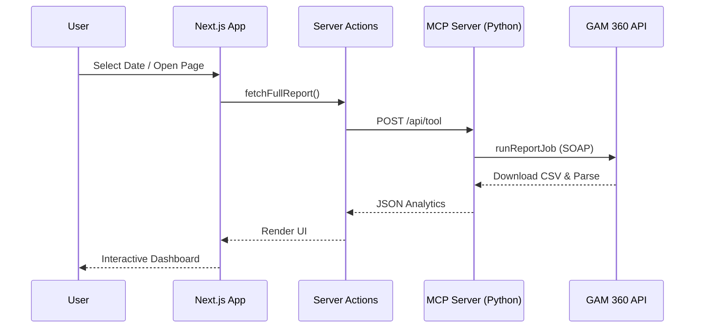

# GAM 360 Live Reporting Platform

**🚀 Live Dashboard:** [https://dashboard-gamma-snowy-42.vercel.app](https://dashboard-gamma-snowy-42.vercel.app)

A Next.js executive BI reporting dashboard that fetches ad revenue analytics **in real-time** from Google Ad Manager 360 using the Model Context Protocol (MCP) server. 

**Zero database. Zero cache. Zero ETL. 100% live.**

---

## 🏛️ System Architecture & Data Flow

This project is a complete end-to-end analytics pipeline that pulls raw data from Google Ad Manager 360 and surfaces it in a real-time dashboard.

### 1. Data Extraction (GAM API → MCP)
* **The MCP Server:** A Python MCP server (`mcp_server/server.py`) connects to the **Google Ad Manager 360 SOAP API**. It builds a `ReportQuery` to fetch daily revenue, impressions, and eCPM on a per-app (Ad Unit) basis in real-time.
* **Stateless Operation:** The architecture is entirely stateless. Data is fetched on-demand, removing the need for cron jobs, ETL pipelines, or permanent historical databases.

### 2. Dashboard State Management (React Context)
* **Global Context:** The Next.js dashboard uses a global `LiveReportProvider` (React Context API) to manage the state of the entire application.
* **Progressive Loading:** Data is loaded incrementally via Server Actions (`Promise.allSettled`), so the UI remains highly responsive as different report sections load in parallel.
* **Reactivity:** Every chart, table, and metric on every page subscribes to this context. When the selected date range changes, the context updates, and **all components instantly re-fetch their data**.

### 3. Concurrency Control
* **Deduplication:** The Python server uses `asyncio.Lock` to coalesce concurrent identical requests within a 30-second window, preventing Google Ad Manager API rate limits when multiple UI components request the same data simultaneously.
* **Bounded Parallelism:** When fetching multi-day trends, requests are batched and executed in parallel using `asyncio.Semaphore`.



### 4. Detailed Execution Workflow
1. **User Interaction:** The user interacts with the Next.js frontend (e.g., changing the date picker to a custom date range with specific hours like 09:00 to 17:00).
2. **State Hydration:** The React Context (`LiveReportProvider`) immediately flags `isLoading=true` and triggers a refresh.
3. **Server Action Dispatch:** Next.js Server Actions concurrently dispatch POST requests to the Python MCP Server's REST API endpoint (`/api/tool`), passing the start date, end date, start time, and end time.
4. **Backend Parsing:** The Python backend parses the constraints in `server.py`, merging the dates and times into a format accepted by the Google Ads API (`PQL` query with `startDateTime` and `endDateTime`).
5. **Report Generation:** `gam_client.py` uses the `AdManagerClient` to dynamically build a `ReportQuery` asking for `DATE`, `HOUR`, `AD_UNIT_NAME`, and financial metrics.
6. **Data Processing:** The SOAP API completes the job, and the backend downloads the GZIP CSV, decompresses it into memory, and loads it into a `pandas` DataFrame.
7. **JSON Serialization:** The pandas DataFrame is converted to JSON and sent back down the wire to Next.js.
8. **UI Rendering:** Next.js receives the data and Recharts dynamically plots the new hour-level granular metrics for the user in real-time.

---

## 🌐 Dashboard Features

The dashboard provides a premium, real-time BI experience:

* **Real-Time BI Dashboard**: Generates comprehensive business intelligence reports dynamically using real-time data.
* **18+ Live Analytics Tools**: The MCP server exposes comprehensive tools covering: executive summaries, revenue by app, trends, top/bottom apps, impressions, clicks, CTR, eCPM, fill rate, ad requests, and performance ranking.
* **AI Anomaly Detection:** Compares current performance against historical averages to detect and flag sudden drops or spikes in real-time.
* **Interactive UI**: Date presets (Today, Yesterday, Last 7 Days, This Month, etc.), custom date ranges (down to the hour), dark mode, and progressive loading skeletons.
* **Instant Export:** One-click CSV, Excel, Markdown, and PDF exports generated directly from the live data on screen.

---

## 🏗️ Tech Stack

### Frontend — Dashboard (`/dashboard`)
| Technology | Purpose |
|-----------|---------|
| **Next.js 16** (App Router) | React framework with server actions |
| **TypeScript** | End-to-end type safety |
| **Tailwind CSS** | Utility-first styling |
| **shadcn/ui** | Accessible, composable UI components |
| **Recharts** | Interactive trend charts |
| **Lucide React** | Icon library |
| **date-fns** | Date manipulation and formatting |

### Backend — MCP Server (`/mcp_server`)
| Technology | Purpose |
|-----------|---------|
| **Python 3.12** | Core server logic |
| **Google Ads API (SOAP)** | Pulls live reports from GAM 360 |
| **Starlette & Uvicorn** | High-performance async ASGI server for REST and SSE |
| **mcp (Model Context Protocol)** | AI integration standard and tool routing |

---

## 🚀 Quick Start

### 1. Install dependencies
```bash
pip install -r requirements.txt
```

### 2. Configure credentials
```bash
cp config/googleads.yaml.example config/googleads.yaml
# Fill in: network_code, path_to_private_key_file, application_name

cp config/.env.example config/.env
# Verify your network code and API settings
```

### 3. Start the MCP server
```bash
cd mcp_server
python server.py
# Server runs on http://localhost:8000
```

### 4. Run the dashboard locally
```bash
# Open a new terminal
cd dashboard
npm install
npm run dev
# Dashboard opens at http://localhost:3000
```

The dashboard will automatically fetch live data from Google Ad Manager when you open it. Use the date preset selector and Refresh button to control when data is fetched.

---

## 📂 Project Structure

```
gam360-pipeline/
├── config/                  # GAM API credentials & env vars
├── mcp_server/              # Python backend connecting to GAM SOAP API
│   ├── server.py            # MCP server with 18+ live analytics tools & REST API
│   └── gam_client.py        # Live data extraction and request deduplication logic
├── dashboard/               # Next.js analytics dashboard
│   ├── src/
│   │   ├── app/             # App Router pages (Dashboard, Reports, Revenue, etc.)
│   │   ├── components/      # Live UI components (header, charts, KPI cards, skeletons)
│   │   ├── contexts/        # LiveReportProvider for global state management
│   │   ├── actions/         # Next.js Server Actions calling the MCP API
│   │   └── types/           # TypeScript type definitions
│   └── package.json
├── requirements.txt         # Python dependencies
└── GAM_DASHBOARD_README.md
```

## License
MIT
