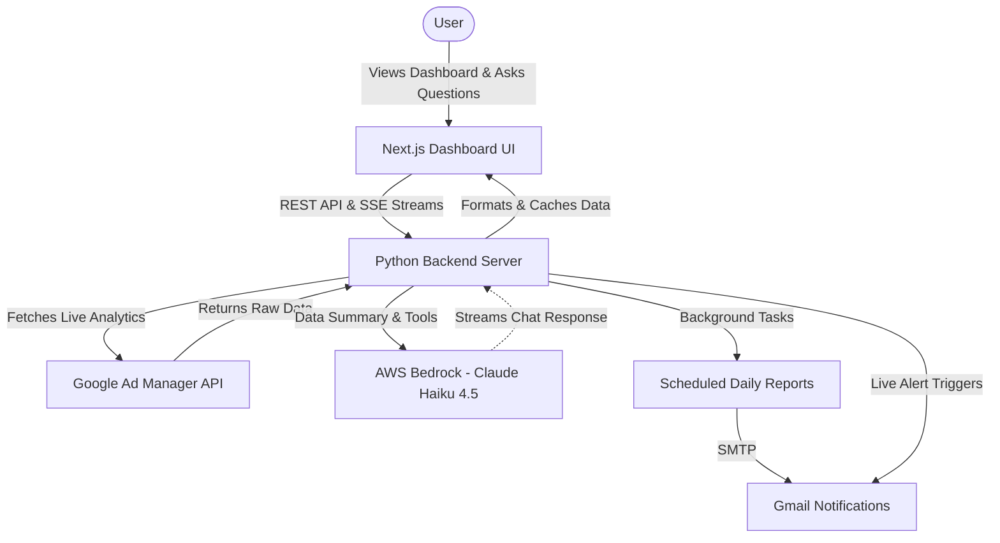

# GAM 360 Live Reporting Platform

A Next.js executive BI reporting dashboard that fetches ad revenue analytics **in real-time** from Google Ad Manager 360.

**Zero database. Zero cache. Zero ETL. 100% live.**

---

## 🏛️ System Architecture & Data Flow



This project is a complete end-to-end analytics pipeline that pulls raw data from Google Ad Manager 360 and surfaces it in a real-time dashboard.

### 1. Unified Data Extraction (GAM API)
* **The Backend:** A Python server (`mcp_server/server.py`) connects to the **Google Ad Manager 360 SOAP API**.
* **Unified Metrics:** The API client pulls metrics across all three Google revenue channels: **Ad Server** (Direct Sold), **AdSense** (Backfill), and **Ad Exchange** (Programmatic Open Auction/Bidding). It merges these into a single unified truth for true network-wide reporting.
* **Stateless Operation:** Data is fetched on-demand directly from Google's servers. There is no historical database or ETL pipeline.

### 2. Dashboard State Management
* **Global Context:** The Next.js dashboard uses a global React Context to manage the state of the entire application.
* **Progressive Loading:** Data is loaded incrementally via Server Actions (`Promise.allSettled`), so the UI remains highly responsive as different report sections load in parallel.
* **Reactivity:** Every chart, table, and metric on every page subscribes to this context. When the selected date range changes, the context updates, and all components instantly re-fetch their data.

### 3. Concurrency Control
* **Deduplication:** The Python server uses `asyncio.Lock` to coalesce concurrent identical requests within a 30-second window, preventing Google Ad Manager API rate limits.
* **Bounded Parallelism:** When fetching multi-day trends, requests are batched and executed in parallel.

### 4. Background Tasks & Notifications
* **Email Notifications:** The server includes a dedicated background task system.
* **Live Alerts:** When anomaly detection thresholds are breached, the system instantly triggers alert emails.
* **Daily Reports:** An asynchronous background loop runs a cron-style schedule to automatically compile and email the full Executive Report once per day.

---

## 🌐 Dashboard Features

* **Website Intelligence Engine [NEW]:** Fully supports Website-level reporting alongside App-level reporting. Pulls 100% live website inventory data directly from Google Ad Manager without any database caching. Easily track website health, top performing domains, CTRs, and impressions.
* **Ask GAM 360 (AI Chat):** A built-in, context-aware AI assistant powered by **AWS Bedrock (Anthropic Claude Haiku 4.5)**. Ask complex questions about your network in natural language — e.g., *"Which website has the highest revenue?"*, *"Are any websites critical?"*, or *"Show me the bottom 3 apps by eCPM"*. It uses strict tool-calling to fetch live GAM data, guaranteeing zero hallucinated numbers, and streams responses instantly.
* **Real-Time BI Dashboard:** Generates comprehensive business intelligence reports dynamically using live data.
* **Unified Revenue:** Combines Ad Server, AdSense, and Ad Exchange into a single consolidated view.
* **18+ Live Analytics Tools:** Executive summaries, revenue by app/website, trends, top/bottom inventory, impressions, clicks, CTR, eCPM, fill rate, and ad requests.
* **AI Anomaly Detection:** Compares current performance against historical averages to detect sudden drops or spikes in real-time.
* **Email Notifications:** Integrated settings panel to manage recipients. Automatically sends instant alerts when anomalies are detected and dispatches a full Executive Report via Gmail every day.
* **Interactive UI:** Custom date ranges (down to the hour), dark mode, and progressive loading skeletons.

---

## 🏗️ Tech Stack

### Frontend — Dashboard (`/dashboard`)
* **Next.js 16** (App Router)
* **TypeScript**
* **Tailwind CSS**
* **shadcn/ui**
* **Recharts**
* **Framer Motion** (Chat UI animations)

### Backend — MCP Server (`/mcp_server`)
* **Python 3.12**
* **Google Ads API (SOAP)**
* **AWS Bedrock — Anthropic Claude Haiku 4.5** (AI Chat, via `boto3` / direct HTTP)
* **Starlette & Uvicorn** (REST & SSE streaming)
* **Pandas** (data merging and processing)

---

## 🚀 Quick Start

### 1. Install dependencies
```bash
pip install -r requirements.txt
```

### 2. Configure credentials
```bash
cp config/googleads.yaml.example config/googleads.yaml
cp config/.env.example config/.env
```

Edit `config/googleads.yaml`:
```yaml
network_code: YOUR_NETWORK_CODE
application_name: GAM360-Revenue-Pipeline
path_to_private_key_file: config/service_account.json
```

Edit `config/.env`:
```env
GAM_NETWORK_CODE=your_network_code

# AWS Bedrock (AI Chat)
AWS_BEARER_TOKEN_BEDROCK=your_bedrock_api_key_here
AWS_REGION=us-east-1
BEDROCK_MODEL_ID=us.anthropic.claude-haiku-4-5-20251001-v1:0

# Email Notifications (optional)
GMAIL_SENDER_EMAIL=your_email@gmail.com
GMAIL_APP_PASSWORD=your_app_password
```

### 3. Set up AWS Bedrock
1. Log in to the **AWS Console** and go to **Bedrock**.
2. In the left menu click **Model access** → **Manage model access**.
3. Enable **Anthropic Claude Haiku 4.5** (or whichever model you choose).
4. Generate a **Bedrock API Key** from the Bedrock console.
5. Paste it as `AWS_BEARER_TOKEN_BEDROCK` in your `.env`.

### 4. Start the backend server
```bash
python -m uvicorn mcp_server.server:starlette_app --reload
# Server runs on http://localhost:8000
```

### 5. Run the dashboard locally
```bash
cd dashboard
npm install
npm run dev
# Dashboard opens at http://localhost:3000
```

---

## ☁️ Deployment (Render + Vercel)

### Backend → Render
The `render.yaml` blueprint is included. Set the following **Environment Variables** in your Render service:

| Variable | Description |
|----------|-------------|
| `GAM_CREDENTIALS_PATH` | Path to your GAM credentials file |
| `GAM_NETWORK_CODE` | Your Google Ad Manager network code |
| `AWS_BEARER_TOKEN_BEDROCK` | Your AWS Bedrock API key |
| `AWS_REGION` | AWS region (e.g. `us-east-1`) |
| `BEDROCK_MODEL_ID` | e.g. `us.anthropic.claude-haiku-4-5-20251001-v1:0` |
| `GMAIL_SENDER_EMAIL` | Gmail address for email alerts (optional) |
| `GMAIL_APP_PASSWORD` | Gmail App Password for SMTP (optional) |

### Frontend → Vercel
Set the following in your Vercel project settings:

| Variable | Value |
|----------|-------|
| `NEXT_PUBLIC_MCP_SERVER_URL` | Your Render backend URL (e.g. `https://gam360-backend.onrender.com`) |

---

## 📁 Project Structure

```
GAM 360 Live Reporting Platform/
├── mcp_server/
│   ├── server.py              # Main Python backend (Starlette + all API routes)
│   ├── gam_client.py          # Google Ad Manager SOAP API client
│   ├── email_service.py       # Email notifications & daily reports
│   ├── render_start.py        # Render.com startup script
│   └── services/
│       └── bedrock_service.py # AWS Bedrock AI service (reusable, modular)
├── dashboard/
│   ├── src/app/               # Next.js App Router pages
│   └── ...
├── config/
│   ├── .env                   # Local environment variables (gitignored)
│   ├── .env.example           # Template for environment variables
│   └── googleads.yaml         # GAM API credentials (gitignored)
├── render.yaml                # Render deployment blueprint
├── requirements.txt           # Python dependencies
└── README.md
```

---

## 🤖 Ask GAM 360 Features & Capabilities

**Ask GAM 360** is a highly capable, context-aware AI reporting analyst powered by **AWS Bedrock (Anthropic Claude Haiku 4.5)**. It uses a multi-tool architecture to fetch **100% live data** directly from Google Ad Manager, ensuring **zero hallucinations**.

The system dynamically routes your natural-language questions to the appropriate backend tool (e.g., `query_gam_data`, `getNetworkSummary`, `getChildNetworkAnalytics`, `getWebsiteInventory`), performs complex pandas aggregations, and streams the analysis back to you.

### Types of Questions It Answers

Ask GAM 360 supports an extensive range of queries across multiple dimensions. Here are the categories of questions it can answer out-of-the-box:

#### 1. Network Code Intelligence & Health
Get a high-level overview of your entire network's performance, complete with automatic anomaly detection and AI-generated insights (strengths, weaknesses, optimization opportunities).
* *"Show network summary"*
* *"What is my network health?"*
* *"Network performance for the past 30 days"*
* *"Show network 12345678"*

#### 2. Child Network (MCM) Analytics
If you use Multiple Customer Management (MCM), you can analyze all your child networks instantly. The AI will compare them, rank them, and flag networks with critical issues.
* *"List all child networks"*
* *"Which child network has the highest revenue?"*
* *"Compare child networks by fill rate"*
* *"Show child networks needing optimization"*

#### 3. Match Rate Analytics
Analyze programmatic Match Rate (Matched Requests ÷ Total Ad Requests) across any dimension.
* *"What is the match rate by app?"*
* *"Which website has the lowest match rate?"*
* *"Show apps with match rate below 60%"*
* *"Compare child networks by match rate"*

#### 4. App & Website Intelligence
Deep dive into specific inventory sources. The AI automatically detects if you are asking about a mobile app or a web domain.
* *"Which website generated the most clicks?"*
* *"Show the best performing apps this month"*
* *"Are there any critical websites right now?"*
* *"Find websites losing revenue compared to yesterday"*

#### 5. Advanced Metric Ranking & Filtering
Sort and filter live data across 20+ preset timeframes (YTD, MTD, past 7 days, etc.) or custom date ranges.
* *"Show the top 5 ad units by eCPM"*
* *"Which app has the lowest fill rate?"*
* *"Show bottom 3 websites by impressions"*

### ⚙️ How it Works (Under the Hood)
1. **Intent Routing**: The AI reads your question and selects the most optimal backend tool (e.g., `getMatchRateAnalytics`, `getChildNetworkAnalytics`).
2. **Live Data Fetching**: The Python backend connects to the Google Ad Manager API and fetches the exact data requested.
3. **Pre-computation**: The backend aggregates the data, scores health (Excellent/Warning/Critical), detects anomalies (e.g., zero revenue, low fill), and computes raw insights.
4. **Streaming Response**: The AI formats these computed insights into a natural, easy-to-read response and streams it token-by-token to the frontend.
