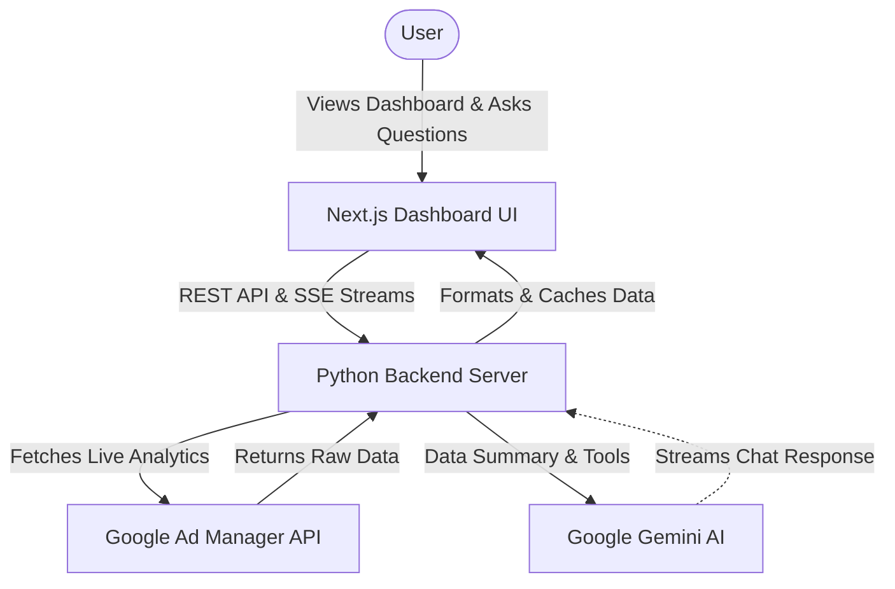

# GAM 360 Live Reporting Platform

A Next.js executive BI reporting dashboard that fetches ad revenue analytics **in real-time** from Google Ad Manager 360. 

**Zero database. Zero cache. Zero ETL. 100% live.**

---

## 🏛️ System Architecture & Data Flow



This project is a complete end-to-end analytics pipeline that pulls raw data from Google Ad Manager 360 and surfaces it in a real-time dashboard.

### 1. Unified Data Extraction (GAM API)
* **The Backend:** A Python server (`mcp_server/server.py`) connects to the **Google Ad Manager 360 SOAP API**. 
* **Unified Metrics:** The API client explicitly pulls metrics across all three Google revenue channels: **Ad Server** (Direct Sold), **AdSense** (Backfill), and **Ad Exchange** (Programmatic Open Auction/Bidding). It merges these into a single unified truth for true network-wide reporting.
* **Stateless Operation:** Data is fetched on-demand directly from Google's servers. There is no historical database or ETL pipeline.

### 2. Dashboard State Management
* **Global Context:** The Next.js dashboard uses a global React Context to manage the state of the entire application.
* **Progressive Loading:** Data is loaded incrementally via Server Actions (`Promise.allSettled`), so the UI remains highly responsive as different report sections load in parallel.
* **Reactivity:** Every chart, table, and metric on every page subscribes to this context. When the selected date range changes, the context updates, and all components instantly re-fetch their data.

### 3. Concurrency Control
* **Deduplication:** The Python server uses `asyncio.Lock` to coalesce concurrent identical requests within a 30-second window, preventing Google Ad Manager API rate limits.
* **Bounded Parallelism:** When fetching multi-day trends, requests are batched and executed in parallel.

---

## 🌐 Dashboard Features

The dashboard provides a premium, real-time BI experience:

* **Ask GAM 360 (AI Chat):** A built-in AI assistant powered by Google Gemini. Open the chat drawer from the sidebar or the floating action button to ask questions about your live data in natural language (e.g., "Which app has the highest revenue?"). It uses an in-memory cache and strict tool calling to guarantee zero hallucinated numbers, and streams the response token-by-token.
* **Real-Time BI Dashboard:** Generates comprehensive business intelligence reports dynamically using live data.
* **Unified Revenue:** Combines Ad Server, AdSense, and Ad Exchange into a single consolidated view.
* **18+ Live Analytics Tools:** Exposes comprehensive tools covering: executive summaries, revenue by app, trends, top/bottom apps, impressions, clicks, CTR, eCPM, fill rate, and ad requests.
* **AI Anomaly Detection:** Compares current performance against historical averages to detect sudden drops or spikes in real-time.
* **Interactive UI:** Custom date ranges (down to the hour), dark mode, and progressive loading skeletons.

---

## 🏗️ Tech Stack

### Frontend — Dashboard (`/dashboard`)
* **Next.js 16** (App Router)
* **TypeScript**
* **Tailwind CSS**
* **shadcn/ui**
* **Recharts**
* **Framer Motion** (for Chat UI animations)

### Backend — MCP Server (`/mcp_server`)
* **Python 3.12**
* **Google Ads API (SOAP)**
* **Google Generative AI SDK (Gemini)**
* **Starlette & Uvicorn** (REST & SSE streaming)
* **Pandas** for data merging and processing

---

## 🚀 Quick Start

### 1. Install dependencies
```bash
pip install -r requirements.txt
```

### 2. Configure credentials
```bash
cp config/googleads.yaml.example config/googleads.yaml
cp config/.env.example config/.env
# Fill in: network_code, path_to_private_key_file, application_name
# Fill in: GEMINI_API_KEY in .env
```

### 3. Start the backend server
```bash
cd mcp_server
python -m uvicorn server:starlette_app --reload
# Server runs on http://localhost:8000
```

### 4. Run the dashboard locally
```bash
# Open a new terminal
cd dashboard
npm install
npm run dev
# Dashboard opens at http://localhost:3000
```

---

## 📂 Project Structure

```text
gam360-pipeline/
├── config/                  # GAM API credentials & env vars
├── mcp_server/              # Python backend connecting to GAM SOAP API
│   ├── server.py            # API server exposing live analytics endpoints & chat SSE stream
│   └── gam_client.py        # Live data extraction, unified metrics merging, and request deduplication
├── dashboard/               # Next.js analytics dashboard
│   ├── src/
│   │   ├── app/             # App Router pages (Dashboard, Reports, Revenue, etc.)
│   │   ├── components/      # Live UI components (header, charts, KPI cards, chat panel)
│   │   ├── contexts/        # React Context for global state management
│   │   └── actions/         # Next.js Server Actions calling the backend API
│   └── package.json
├── requirements.txt         # Python dependencies
└── README.md
```

## License
MIT
