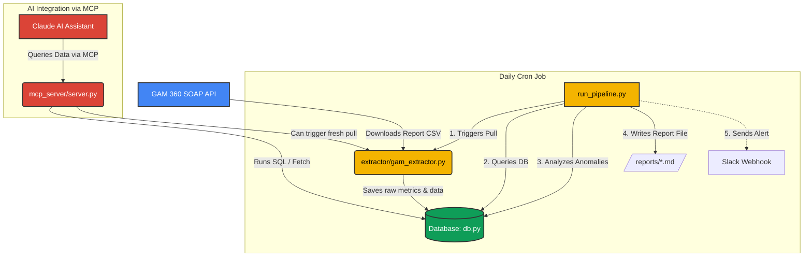

# GAM 360 Revenue Pipeline — SOAP API + MCP

Full pipeline to extract revenue data from Google Ad Manager 360
using the SOAP API, store it in a database, and expose it via MCP
for Claude-powered summarization and reporting.

## Architecture



## Quick start

### 1. Install dependencies
```bash
pip install -r requirements.txt
```

### 2. Configure credentials
```bash
cp config/googleads.yaml.example config/googleads.yaml
# Fill in: network_code, path_to_private_key_file, application_name
```

### 3. Set up the database
```bash
python database/db.py --init
```

### 4. Run the extractor (pulls yesterday's revenue by app)
```bash
python extractor/gam_extractor.py --date yesterday
```

### 5. Start the MCP server
```bash
python mcp_server/server.py
```

## Matching GAM 360 Dashboard

The SOAP API report uses the exact same dimensions/metrics as the GAM UI:

| GAM Dashboard column   | SOAP API Column                        |
|------------------------|----------------------------------------|
| Total revenue          | AD_SERVER_CPM_AND_CPC_REVENUE          |
| Impressions            | AD_SERVER_IMPRESSIONS                  |
| Clicks                 | AD_SERVER_CLICKS                       |
| eCPM                   | AD_SERVER_WITHOUT_CPD_AVERAGE_ECPM     |
| Fill rate              | AD_SERVER_FILL_RATE                    |
| Ad requests            | AD_SERVER_AD_REQUESTS                  |

| GAM Dashboard dimension | SOAP API Dimension                     |
|-------------------------|----------------------------------------|
| App name (ad unit)      | AD_UNIT_NAME                           |
| Date                    | DATE                                   |
| Order                   | ORDER_NAME                             |
| Line item               | LINE_ITEM_NAME                         |
| Ad type                 | AD_REQUEST_AD_TYPE                     |
| Country                 | COUNTRY_NAME                           |

## Per-app revenue

GAM 360 organises apps as **Ad Units** in the inventory hierarchy.
Each mobile app has a top-level ad unit (e.g. "com.yourco.appname").
The extractor uses `AD_UNIT_NAME` + `AD_UNIT_ID` dimensions and
filters by parent ad unit to isolate each app.
